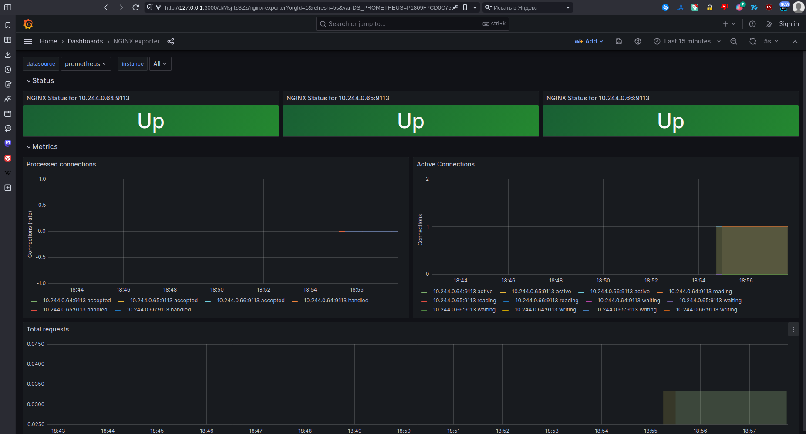

# Выполнено ДЗ № 8

 - [X] Основное ДЗ

## В процессе сделано:
 - По официальной документации включил в NGINX stub_status
 ```
 https://nginx.org/ru/docs/http/ngx_http_stub_status_module.html
 ```
 - Собран и залит образ на dockerhub
 - Написан deploy deploy/metrics.yaml, включающий в себя Deployment, Service и ServiceMonitor
 - Написан Helmfile для развертки kube-prometheus-stack и grafana, так же описаны values для автоматического коннекта датасурса к графане и создания дашборда с библиотеки Grafana Labs 
 - Проверена работоспособность связки
 1. kubectl port-forward service/grafana 3000:3000
 2. В браузере https://localhost:3000 -> Home -> Dashboards -> NGINX exporter



## Как запустить проект:
 - docker pull straymoonfox/nginx-metrics
 - helmfile apply --file deploy/helmfile.yml
 - kubectl apply -f deploy/metrics.yml
 - kubectl port-forward service/grafana 3000:3000
 - В браузере https://localhost:3000 -> Home -> Dashboards -> NGINX exporter

## Как проверить работоспособность:
 - После применения деплоймента Dashboard

## PR checklist:
 - [X] Выставлен label с темой домашнего задания