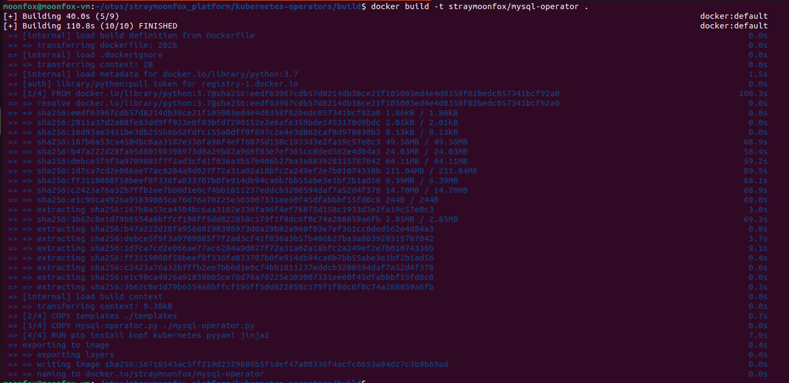

# Выполнено ДЗ № 7

 - [X] Основное ДЗ

## В процессе сделано:
 - Создание CRD и CR
 1. Создан и применен cr
 
 2. Создан и применен crd 
 

 - Создание контроллера
 ТЗ: 
  1. При создании объекта типа ( kind: mySQL ), он будет:
  * Cоздавать PersistentVolume, PersistentVolumeClaim, Deployment, Service для mysql
  * Создавать PersistentVolume, PersistentVolumeClaim для бэкапов базы данных, если их еще нет.
  * Пытаться восстановиться из бэкапа
  2. При удалении объекта типа ( kind: mySQL ), он будет:
  * Удалять все успешно завершенные backup-job и restore-job
  * Удалять PersistentVolume, PersistentVolumeClaim, Deployment, Service для mysql
 
  1. Создан mysql-operator.py в build
  2. Созданы Jinja шаблоны build/templates
  3. Создан Dockerfile, собран образ и залит на Dockerhub 

  
  

  - Создание манифестов для деплоя оператора service-account.yml role.yml role-binding.yml deploy-operator.yml  
  Создаем и применяем манифесты: 
  

  
  
  ```
  moonfox@moonfox-vm:~/otus/straymoonfox_platform/kubernetes-operators$ kubectl get pvc
NAME                        STATUS   VOLUME                                     CAPACITY   ACCESS MODES   STORAGECLASS   AGE
backup-mysql-instance-pvc   Bound    pvc-954e0429-05a6-4320-a7f5-59aaff2383c2   1Gi        RWO            standard       9m4s
mysql-instance-pvc          Bound    pvc-bd50baa9-7e8e-4896-bee2-937c56fd235c   1Gi        RWO            standard       9m4s
  ```

  Заполняем тестовую базу и смотрим результат:
   ```
 - export MYSQLPOD=$(kubectl get pods -l app=mysql-instance -o jsonpath="{.items[*].metadata.name}")

 - kubectl exec -it $MYSQLPOD -- mysql -u root -potuspassword -e "CREATE TABLE test ( id smallint unsigned not null auto_increment, name varchar(20) not null, constraint pk_example primary key (id) );" otus-database
 
 - kubectl exec -it $MYSQLPOD -- mysql -potuspassword -e "INSERT INTO test ( id, name ) VALUES (null, 'some data' );" otus-database

 - kubectl exec -it $MYSQLPOD -- mysql -potuspassword -e "INSERT INTO test ( id, name ) VALUES (null, 'some data-2' );" otus-database

 - kubectl exec -it $MYSQLPOD -- mysql -potuspassword -e "select * from test;" otus-database

 ```
 


## Как проверить работоспособность:
 - cd kubernetes-operators && kubectl apply -f deploy/crd.yml && kubectl apply -f deploy/cr.yml
 - docker pull straymoonfox/mysql-operator
 - kubectl apply -f deploy/service-account.yml && kubectl apply -f deploy/role.yml &&  kubectl apply -f deploy/role-binding.yml &&  kubectl apply -f deploy/deploy-operator.yml
 -
 ```
 - export MYSQLPOD=$(kubectl get pods -l app=mysql-instance -o jsonpath="{.items[*].metadata.name}")

 - kubectl exec -it $MYSQLPOD -- mysql -u root -potuspassword -e "CREATE TABLE test ( id smallint unsigned not null auto_increment, name varchar(20) not null, constraint pk_example primary key (id) );" otus-database
 
 - kubectl exec -it $MYSQLPOD -- mysql -potuspassword -e "INSERT INTO test ( id, name ) VALUES (null, 'some data' );" otus-database

 - kubectl exec -it $MYSQLPOD -- mysql -potuspassword -e "INSERT INTO test ( id, name ) VALUES (null, 'some data-2' );" otus-database

 - kubectl exec -it $MYSQLPOD -- mysql -potuspassword -e "select * from test;" otus-database

 ```

## PR checklist:
 - [X] Выставлен label с темой домашнего задания