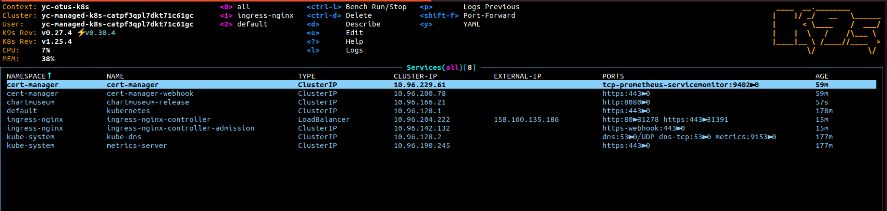

# Выполнено ДЗ № 6

 - [X] Основное ДЗ
 - [X] Задание со * 1
 - [X] Задание со * 2

## В процессе сделано:
 
 - Развернут кластер в YC при помощи Terraform
 1. По мануалу яндекса - https://cloud.yandex.ru/ru/docs/managed-kubernetes/operations/kubernetes-cluster/kubernetes-cluster-create
 2. cd terraform; terraform plan; terraform apply
 
 - Установка nginx-ingress
 1. ```helm repo add ingress-nginx https://kubernetes.github.io/ingress-nginx && helm repo update && helm install ingress-nginx ingress-nginx/ingress-nginx -n ingress-nginx --create-namespace```
 
 
 - Установка cert-manager
 1. Добавляем репозиторий с cert-manager ```helm repo add jetstack https://charts.jetstack.io```
 2. Создаем NS :
 ```kubectl apply -f cert-manager/namespace.yml```

 ```Source : https://cert-manager.io/docs/configuration/acme/http01/```
 
 4. Устанавливаем crd
 ```kubectl apply -f https://github.com/cert-manager/cert-manager/releases/download/v1.13.3/cert-manager.crds.yaml```
 3. Устанавливаем cert-manager
 ```helm install cert-manager jetstack/cert-manager -n cert-manager --version v1.13.3```
 5. создаем и деплоим ClusterIssuer 
``` kubectl apply -f cert-manager/clusterissuer.yml```

 
 

 -  Устанавливаем chartmuseum
 1. создаем namespase chartmuseum
 ```kubectl create ns chartmuseum```
 2. ```helm repo add chartmuseum https://chartmuseum.github.io/charts```
 3. Деплоим chartmuseum
 ```helm install chartmuseum-release chartmuseum/chartmuseum  --wait -n=chartmuseum -f chartmuseum/values.yaml```
 
 Результат:
 

 - Устанавливаем harbor
 1. ```helm repo add harbor https://helm.goharbor.io```
 3. ```helm install harbor harbor/harbor --namespace=harbor --create-namespace --values harbor/values.yaml```

Результат:


 - Задание со * Описание Helmfile
  1. Описан helmfile.yaml  для развертки ingress-nginx cert-manager и harbor

    - Создание Helmchart

    1. helm create hipster-shop
    2. из содержимого файла https://github.com/express42/otus-platform-snippets/blob/master/Module-04/05-Templating/manifests/all-hipster-shop.yaml 
    создаем чарты hipster-shop и frontend
    3. добавляем frontend как зависимость для чарта hipster-shop, для этого прописываем в файл ./hipster-shop/Chart.yaml следующие строки:
    ```
    dependencies:
    - name: frontend
        version: 0.1.0
        repository: "file://../frontend"
    ```

    3. Создаем secret 
    ```
    gpg --full-generate-key
    sops -e -i --pgp E54C4BAA7C691A24BF08F5CA3B017C11386E6D14 secrets.yaml
    ```

    4. Обновляем зависимости  
    ```helm dep update kubernetes-templating/hipster-shop```
    5. Деплоим чарт hipster-shop, автоматически задеплоится чарт frontend
    ```helm install hipster-shop hipster-shop --namespace=hipster-shop --create-namespace```

    Результат:
    
    

    6. меняем NodePort с помощью ключа --set не меняя его в values.yaml  
    ```helm upgrade hipster-shop hipster-shop --namespace=hipster-shop --set frontend.service.NodePort=31234```
    
    Результат:
    

    - задание со * добавить в зависимости redis, чтобы он деплоился вместе с релизом hipster-shop

    1. добавляем в Chart.yml в раздел dependencies строки:
    ```
    - name: redis
        version: latest
        repository: https://charts.bitnami.com/bitnami
    ```
   
   - kubecfg
   1. выносим service и deployment от сервисов paymentservice и shippingservice в папку kubernetes-templating/kubecfg
   2. деплоим снова наш чарт и видим, что при добавлении в козину товаров - сайт выдает ошибку
   3. устанавливаем kubecfg
   4. Указваем libsonnet библиотеку, которую будем использовать для генерации манифестов. https://github.com/bitnami-labs/kube-libsonnet/
   5. получился файл kubernetes-templating/kubecfg/services.jsonnet
   6. деплоим kubecfg update kubernetes-templating/kubecfg/services.jsonnet --namespace hipster-shop


   
   - 
    1. выносим сервис cartservice в отдельную директорию kustomize/cartservice 
    2. Описываем файл kustomize/cartservice/kustomization.yaml
    3. Необходимо чтобы деплой сервиса происходил по команде 
    ```kubectl apply -k kubernetes-templating/kustomize/overrides/<Название окружения>/```
     в разные нейспейсы с разными тегами и префиксом в названии.
    4. Cоздаем файлы в директории kubernetes-templating/kustomize/overrides/{stage,prod}/kustomization.yaml, в которых ссылаемся на файл, описанный в предыдущем пункте.


## Как проверить работоспособность:
 - Проверка работоспособности приложена в виде скриншотов

## PR checklist:
 - [X] Выставлен label с темой домашнего задания